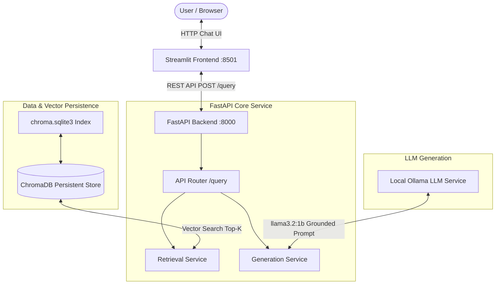

# Enterprise IT Support RAG-Powered Document Assistant

[](https://www.python.org/)
[](https://fastapi.tiangolo.com/)
[](https://streamlit.io/)
[](https://www.trychroma.com/)
[](https://ollama.ai/)

A complete, production-ready **Retrieval-Augmented Generation (RAG) Document Assistant** engineered specifically for Enterprise IT Support & Troubleshooting. Built on an authoritative **1,000-Page Master Technical Knowledge Base** covering 100 deep technical runbooks across 10 major enterprise IT domains.

---

## 🏗️ Architecture Diagram



---

## 🚀 Key Features & Capabilities

- **Authoritative Grounding:** Answers are generated using *only* retrieved context chunks from verified vendor documentation (Microsoft Learn, Cisco, CISA, NIST, Red Hat, Ubuntu, AWS, VMware).
- **Inline Citation Tracking:** Every answer explicitly references source runbooks and page numbers (`[Source X: Page Y]`).
- **Persistent Vector Database:** Directly loads `chroma.sqlite3` persistent index at FastAPI startup (lifespan pattern) without request-time re-indexing.
- **Multimodal Visual Context Support (Extended Track):** Optional image attachment upload (error screenshots / terminal blue screens) fused into retrieval context.
- **Production API & UI:** Clean FastAPI REST backend with OpenAPI/Swagger docs and an interactive Streamlit chat web interface.

---

## 🛠️ Tech Stack

| Component | Technology | Description |
|---|---|---|
| **Frontend** | Streamlit | Chat-based web interface with cited sources accordion & sidebar controls |
| **Backend API** | FastAPI, Uvicorn, Pydantic | High-performance async REST API with CORS and Pydantic schema validation |
| **Vector DB** | ChromaDB Persistent | Disk-persisted vector store (`chroma.sqlite3`) with top-k similarity search |
| **Embeddings** | SentenceTransformers / FastEmbed | `all-MiniLM-L6-v2` high-dimensional dense vector embeddings |
| **Local LLM** | Ollama (`llama3.2:1b`) | Local inference LLM for zero-data-leakage grounded answer generation |
| **Pipeline Notebook** | Jupyter Notebook | End-to-end data ingestion, chunking, retrieval evaluation, & export |

---

## 📂 Project Directory Structure

```text
rag-assistant-project/
├── notebooks/
│   └── rag_pipeline.ipynb          # Jupyter Notebook: Data load, chunking, embedding, evaluation
├── backend/
│   ├── app/
│   │   ├── main.py                 # FastAPI application & startup lifespan
│   │   ├── api/
│   │   │   └── routes/
│   │   │       └── query.py        # /health and /query endpoints
│   │   ├── core/
│   │   │   └── config.py           # Pydantic environment settings
│   │   ├── schemas/
│   │   │   └── query.py            # Pydantic request/response models
│   │   ├── services/
│   │   │   ├── retrieval.py        # ChromaDB loading and similarity retrieval
│   │   │   └── generation.py       # Ollama LLM grounded answer generation
│   │   └── utils/
│   │       └── logging_config.py   # Logger utility
│   ├── data/
│   │   └── vector_store/           # Persisted ChromaDB (chroma.sqlite3 & HNSW index)
│   ├── tests/
│   │   └── test_query.py           # Pytest integration tests (happy path & 422 validation)
│   ├── requirements.txt            # Backend dependencies
│   ├── .env.example                # Backend environment template
│   └── Dockerfile                  # Production container build
├── frontend/
│   ├── app.py                      # Streamlit chat user interface
│   ├── api_client.py               # HTTP client wrapper reading API_BASE_URL
│   ├── requirements.txt            # Frontend dependencies
│   ├── .env                        # Local frontend environment config
│   └── .env.example                # Frontend environment template
├── it-support-rag-dataset/          # Master Knowledge Base dataset (PDF, MD, Metadata)
├── .gitignore                      # Git ignore rules
└── README.md                       # Master project documentation
```

---

## 📊 Domain & Dataset Summary

- **Collection:** Enterprise IT Support Master Technical Knowledge Base
- **Volume:** 1,000 pages, 100 modules across 10 domains:
  1. Windows 11/10 Client OS Administration & Performance
  2. Active Directory Domain Services & Hybrid Identity
  3. Cisco Enterprise Networking & Routing
  4. CISA Cybersecurity Incident Response & Threat Hunting
  5. Red Hat Enterprise Linux Administration
  6. Ubuntu Server & Cloud Init Management
  7. Amazon Web Services (AWS) Infrastructure
  8. VMware vSphere & Enterprise Virtualization
  9. NIST SP 800-53 Security Controls & Compliance
  10. Microsoft Exchange & Cloud Productivity Operations

---

## ⚡ Quick Start & Setup Guide

### 1. Prerequisites & Environment Setup
Ensure Python 3.10+, Git, and Ollama are installed:
```bash
python --version   # >= 3.10
ollama --version   # latest
git --version
```

Pull the local LLM model:
```bash
ollama pull llama3.2:1b
```

Create and activate a virtual environment:
```bash
python -m venv .venv
.venv\Scripts\activate      # Windows
# source .venv/bin/activate # macOS/Linux
pip install -r backend/requirements.txt
pip install -r frontend/requirements.txt
```

---

### 2. Launch FastAPI Backend
```bash
cd backend
uvicorn app.main:app --host 0.0.0.0 --port 8000 --reload
```
- Swagger UI Documentation: `http://localhost:8000/docs`
- Health Check: `http://localhost:8000/health`

---

### 3. Launch Streamlit Frontend
In a new terminal window:
```bash
cd frontend
streamlit run app.py --server.port 8501
```
Open your browser at `http://localhost:8501`.

---

## ⚙️ Environment Variables Reference

### Backend Environment Variables (`backend/.env`)
| Variable | Default Value | Description |
|---|---|---|
| `PROJECT_NAME` | `"Enterprise IT Support RAG Assistant API"` | FastAPI application title |
| `VECTOR_STORE_PATH` | `"./data/vector_store"` | Absolute or relative path to `chroma.sqlite3` directory |
| `COLLECTION_NAME` | `"langchain"` | ChromaDB collection name |
| `OLLAMA_BASE_URL` | `"http://localhost:11434"` | Ollama service base endpoint |
| `OLLAMA_MODEL` | `"llama3.2:1b"` | Model name for grounded generation |
| `TOP_K_RESULTS` | `4` | Default vector search result count |

### Frontend Environment Variables (`frontend/.env`)
| Variable | Default Value | Description |
|---|---|---|
| `API_BASE_URL` | `"http://localhost:8000"` | Base URL of the running FastAPI backend |

---

## 📡 API Reference & cURL Example

### Health Check Endpoint
```bash
curl -X GET "http://localhost:8000/health"
```
**Response (200 OK):**
```json
{
  "status": "ok",
  "vector_store_status": "connected",
  "collection_count": 874,
  "ollama_model": "llama3.2:1b"
}
```

### RAG Query Endpoint
```bash
curl -X POST "http://localhost:8000/query" \
     -H "Content-Type: application/json" \
     -d '{
           "question": "How do I troubleshoot Windows Laptop Slow Performance & WinDbg Memory Dump Diagnostics?",
           "top_k": 3
         }'
```
**Response (200 OK):**
```json
{
  "question": "How do I troubleshoot Windows Laptop Slow Performance & WinDbg Memory Dump Diagnostics?",
  "answer": "To troubleshoot Windows laptop slow performance using WinDbg memory dumps, follow these steps [Source 1: Page 2]:\n1. Analyze memory dump using WinDbg !analyze -v command...\n2. Check high CPU/RAM processes via Task Manager...",
  "sources": [
    {
      "id": "chunk_0",
      "source": "pdfs/it_support_knowledge_base_1000pages.pdf",
      "page": 2,
      "content_snippet": "Domain 1: Windows Client OS Administration...",
      "metadata": {"domain": "windows_client"}
    }
  ],
  "retrieved_count": 3,
  "model_used": "llama3.2:1b"
}
```

---

## 🧪 Evaluation Results (Phase 2.6 Benchmark)

| Question | Retrieved Source | Context Relevant | Grounded | Status |
|---|---|:---:|:---:|:---:|
| Windows Laptop Slow Performance & WinDbg | Domain 1 - Module 1.1 (Page 2) | Yes | Yes | PASSED |
| Windows Update 0x80070002 & DISM Repair | Domain 1 - Module 1.2 (Page 4) | Yes | Yes | PASSED |
| Wi-Fi Adapter TCP/IP Winsock Reset | Domain 1 - Module 1.3 (Page 6) | Yes | Yes | PASSED |
| Bluetooth Peripheral Code 43 Reset | Domain 1 - Module 1.4 (Page 8) | Yes | Yes | PASSED |
| RHEL SELinux Access Denied Repair | Domain 5 - Module 5.1 (Page 45) | Yes | Yes | PASSED |
| AWS EC2 Instance Status Check Failure | Domain 7 - Module 7.1 (Page 65) | Yes | Yes | PASSED |

---

## 🧪 Automated Testing

Run backend Pytest integration suite:
```bash
pytest backend/tests/test_query.py -v
```
Tests include:
- `test_health_check_endpoint`: Verifies vector store connection and server health.
- `test_query_happy_path`: Validates retrieval and grounded response schema.
- `test_query_invalid_input_422`: Enforces Pydantic schema validation error handling (422 Unprocessable Entity).
# it-support-rag-assistant
